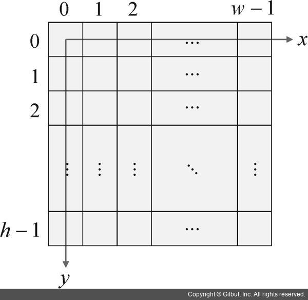
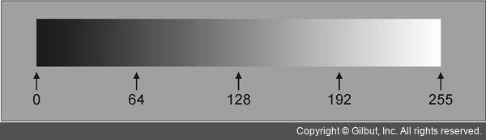

# OpenCV_study 2021-12-4th week


## 컴퓨터 비전과 영상의 이해


### 컴퓨터 비전

+ 정지 영상 또는 동영상으로부터 의미있는 정보를 추출하는 방법을 연구하는 학문

> 사람이 무언가를 보고 인지하는 것은 매우 쉬운 일이나, 컴퓨터에게는 다르다. 예를 들어서 사람은 청포도와 적포도를 같은 포도라는 카테고리로 인식하지만 컴퓨터의 경우에는 정해진 데이터(예를 들면 포도는 자주빛이다.)를 통하여 인식하기 때문에, 청포도는 포도라고 인식하지 못한다. 청포도 또한 포도라는 것을 인식시키기 위해서는 포도라는 물체에 대한 전반적인 데이터(예를 들어, 중간에 가지가 있고, 동글 동글한 알맹이가 달린 건 포도이다.)가 필요한데 여기서 블랙 사파이어가 들어가면 또 다른 정의(동글랗지 않고 길죽한 물건이 달어도 포도이다.) 한 층 복잡해진다. 따라서, 이러한 것들을 인식하기 위해서 밝기, 색상, 모양, 텍스쳐등을 복합적으로 분석하여 유용한 정보를 추출하는 방법을 다룬다.

### 영상을 구성하는 요소

+ 픽셀

> 하나의 밝기 또는 색상을 표현한다.

+ 영상

> 픽셀이 바둑판같은 균일한 격자로 모여있는 것 (가로 : x, 세로 : y)




### 그레이 스케일 영상과 컬러 영상

+ 그레이 스케일

> 밝기 정보를 256단계로 구분하여 표현한 영상 (0~255의 값을 가진다.)
>
> C/C++에서는 unsigned char 자료형을 사용한다. (BYTE: Windows, unit8_t: Linux, uchar: OpenCV)




+ 컬러

> R, G, B 세 개의 색상 성분 조합으로 픽셀 값을 표현한다. 0은 해당 성분이 없음을 의미하고, 255는 해당 색상 성분이 가득 차 있음을 의미한다.


## OpenCV 개요와 설치


### OpenCV 설치


의존상 설치

- 이미지 파일
  - libjpeg-dev : JPEG 런타임 라이브러리
  - libtiff5-dev : Tag Image File Format Library(TIFF) 개발 파일
  - libpng-dev : PNG 형식 파일을 읽고 쓰기 위한 인터페이스를 구현


- 비디오 파일
  - ffmpeg : 디지털 음성, 영상 스트림에 대해 다양한 종류의 형태로 기록하고 변환하는 컴퓨터 프로그램
  - libavcodec-dev : 오디오, 비디오 코덱용 디코더, 인코더가 있는 ffmpeg 라이브러리
  - libavformat-dev : 멀티미디어 컨테이너용 멀티플렉서가 있는 ffmpeg 라이브러리
  - libswscale-dev : 이미지 스케일링 및 변환을 위한 ffmpeg 라이브러리
  - libxvidcore-dev : 품질 및 속도를 위한 어셈블러 최적화 및 저장과 보관을 위한 라이브러리
  - libx264-dev : libx264 코덱용 개발 파일
  - libxine2-dev : xine 비디오 플레이어 라이브러리


- 웹캠 및 비디오 스트림
  - libv4l-dev : video4linux(리눅스에서 비디오에대한 제어, 사용) 지원 라이브러리
  - v4l-utils : 미디어 디바이스를 처리하기 위한 패키지
  - libgstreamer1.0-dev : 실시간 사운드 처리, 비디오 재생 및 기타 미디어 관련 작업 수행
  - libgstreamer-plugins-base1.0-dev : 일부 라이브러리에 대한 컴파일 지원


- GUI
  - libgtk-3-dev : GTK(Gimp ToolKit 리눅스에서  GUI를 다루기위한 라이브러리의 한 종류) 라이브러리


- 행렬 연산 최적화
  - libatlas-base-dev : 선형 대수 소프트웨어
  - gfortran : GNU Fortran 컴파일러
  - OpenCV_coordinate_system.jpglibeigen3-dev : 벡터, 행렬 연산을 위한 경량  C++ 템플릿 라이브러리


- VTK
  - libvtk7-dev : C++ 에서 VTK와 3D 시각화 컴파일러용 헤더

### OpenCV 개요

+ OpenCV(Open Source Computer Vision Library)는 BSD 라이센스를 따르는 오픈 소스의 컴퓨터 비전 및 머신 러닝 라이브러리이다. BSD 라이센스를 취득하였기 때문에 상업적인 용도나, 학계 연구용으로 자유롭게 사용할 수 있다.
+ 2500개가 넘는 최신 컴퓨터 비전 알고리즘과 머신 러닝 알고리즘을 포함하여, 기본적인 영상 파일 입출력, 영상의 화질 향상, 객체 검출과 인식, 추적 3차원 비전 문제 해결등의 기능을 제공하고, kNN(k-Nearest Neighbor) 등과 같은 머신 러닝 알고리즘 뿐만 아니라 DNN(Deep Neural Network) 모델을 실행하는 딥러인도 추가되어 활용도가 더욱 높아지고 있다.
+ OpenCV는 C/C++를 사용하여 실시간 처리를 고려하여 만들어졌기 때문에 다양한 하드웨어 플랫폼(Mac os, Windows, Linux, Android, iOS...)에서 빠르게 동작한다. 그러나 요즘에는 Python, Java, Mathlab,등의 인터페이스를 지원한다. 또한, 대부분 병렬 처리로 동작하며, MMX, SSE, AVX, NEON같은 CPU 특화 명령뿐만 아니라 CUDA와 OpenCL을 통한 GPU활용도 지원하고 있다.


### OpenCV 역사

+ 1999년 인텔에서 개발된 IPL(Image Processing Livbrary)을 기반으로 만들어져서 2000년에 일반에 공개되어 오픈소스로 개발이 진행되다가. 2006년에 C언어 기반의 OpenCV 1.0이 정식으로 배포되었다.

| OpenCV Version | OpenCV 1.0     | OpenCV 2.0     | OpenCV 3.0                                                   | OpenCV 4.0                                                   |
| -------------- | -------------- | -------------- | ------------------------------------------------------------ | ------------------------------------------------------------ |
| 출시년도       | 2006           | 2009           | 2015.06                                                      | 2018.11                                                      |
| 언어           | C              | C, C++         | C, C++, C++11(3.3)                                           | C++11 필수 지원                                              |
| 특이사항       | 정식 배포 시작 | Mat class 활용 | T-API 지원<br />IPP 무료화<br />DNN 추가(3.3)<br />AVX, AVX2, SSE4.X | C++11 컴파일러나 문법 사용가능<br />CAPI지원이 종료 (IplImage사용불가)<br />DNN모듈 기능 강화<br />(AlexNet, Inception v2, Resnet, VGG)<br />(Mask-RCNN, tiny YOLO) |


### OpenCV의 모듈과 확장자

+ OpenCV는 다양한 모듈(core, highgui …)을 이용하여 만들어졌다.

+ OpenCV는 .lib와 .dll 확장자를 사용한다.

+ 대부분의 컴퓨터 비전 프로그램에서는 core, imacodecs. Imgproc, highgui을 항상 필요로 하여 편리성을 위해서  world 모듈(OpenCV에서 제공하는 모든 모듈을 합친 모듈)을 제공한다.

+ OpenCV의 추가 모듈은 opencv_contrib라는 저장소를 통해서 받거나, 빌드하여 사용할 수 있다. 


### OpenCV의 유용한 사이트 모음

+ https://opencv.org : 공식 웹사이트

+ [Https://docs.opencv.org/](Https://docs.opencv.org/) : OpenCV 함수 또는 클래스에 대한 자세한 설명이 적혀있는 사이트.


### OpenCV 간단한 코드 예시

``` 
#include <opencv/opencv.hpp>
#include <iostream>

using namespace cv;
using namespace std;

int main() {
    Mat img; 
    //Mat class img 변수 선언
    img = imread("../sample.png");
    // cv namespace의 imread 함수를 사용하여, sample.png 파일을 img 변수에 저장, 실행 파일의 위치에 따른 조정 필요, 여기서는 build 폴더 안에 파일이 들어가 있으므로, 상위 폴더에 대한 상대 경로를 조정해주어야 한다.
    namedWindow("image");
    // namedWindow()함수를 사용하여 화면에 새로운 창을 생성하고 그 창에 image라는 이름을 부여
    imshow("image", img);
    // imshow()함수를 사용하여, image창에 img 객체의 sample.png를 전달
    waitKey();
    // 무작위 입력이 들어오기 전까지 정지
    return 0;
}
```

```
#include <opencv2/opencv.hpp>


int main() {
   cv::Mat mat(200, 200, CV_8UC3); // cv 헤더 안의 Mat 클래스로 mat 변수 선언
   mat(cv::Rect(0, 0, 100, 200)) = cv::Vec3b(255, 255, 255); //mat 변수에 값 대입
   //cv::Rect(x_coordinate, y_coordinate, width, height) (x,y)좌표에 width*height크기의 창을 띄움
   //cv::Vec3b(blue, green, red)
   cv::imshow("mat", mat); // "mat"이라는 창에 mat변수 출력
   cv::waitKey(0); // key값이 들어오기 전까지 괄호 안의 시간만큼 대기, 0은 무한 대기
   return 0;
}
```

```
cmake_minimum_required(VERSION 3.0)
project(project_name) // project_name 입력
find_package(OpenCV REQUIRED PATHS $ENV{HOME}/mylib/lib)
// 해당 패키지(여러 모듈(독립되어 있는 하나의 소프트웨어)이 모여진 집합)가 설치된 위치를 잡아준다
include_directories(${OpenCV_INCLUDE_DIRS}) // 헤더 파일 경로 표시
set(SOURCES cpp_file_name.cpp) // CMake할 cpp파일 지정
add_executable(${PROJECT_NAME} ${SOURCES}) // 실행 파일 지정
target_link_libraries(${PROJECT_NAME} ${OpenCV_LIBS}) // 실행 파일과 라이브러리 컴바인
```


 ### OpenCV 유용한 함수 정리

``` 
Mat imread(const String& filename. Int flags = IMREAD_COLOR)
```

+ String(std::string) 형식의 filename을 가져와서 IMREAD_COLOR형에 맞는 형식으로 Mat class를 반환한다.

 

``` 
bool imwrite(const String& filename, InputArray img, const std::vector<int>& params = std::vector<int>());
```

+ InputArrar 형식의 Img 변수에 저장된 데이터를 params 형식에 맞는 방식으로 filename으로 저장한다.

> ImputArray type : Mat, vector<T>등의 다양한 객체를 표현핧 수 있는 인터페이스 클래스

 

``` 
bool Mat::empty ()
```

+ Mat class의 객체가 nullptr이거나 0이라면 true를 반환한다.

 

``` 
Void namedWindow(const String& winname, int flags = WINDOW_AUTOSIZE)
```

+ flags에 맞는 창의 속성으로 String 형식의 winname으로 창 고유 이름을 지정하고 생성한다.


``` 
Void destroyWindow(const String& winname);
```

+ winnname의 창을 닫는다.


``` 
Void destroyAllWindow();
```

+ 모든 창을 닫는다.

 

``` 
Void moveWindow(const String& winname, int x, int y)
```

+ (x,y)의 좌표에 winname창을 이동시킨다.

 

``` 
Void resizeWiondow(const String& winname, int width, int height);
```

+ width(가로크기)와 height(세로크기)에 맞춰서 winname 창의 크기를 변경한다.

 

``` 
void imshow(const String& winname, InputArray mat);
```

+ winname 창에 mat 인자로 전달된 영상 데이터를 출력한다. 만약에 해당하는 winname창이 없으면 새로 만든다.

 

``` 
int waitKey(int delay = 0);
```

+ delay 변수에 선언된 숫자만큼 ms동안 키 입력을 기다린다.

> imshow() 함수가 선언된 뒤에, waitKey() 함수가 없다면, imshow()함수는 동작하지 않는다.
