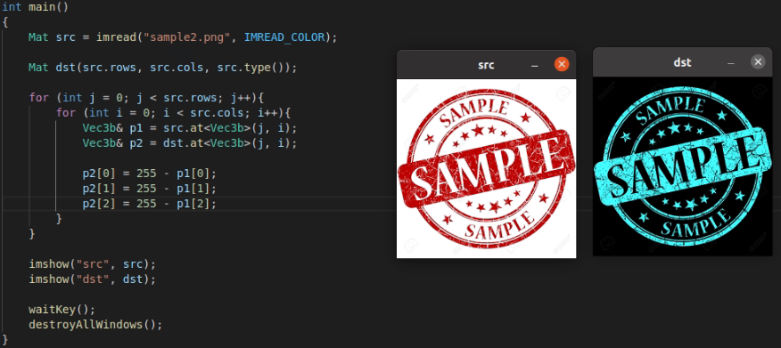
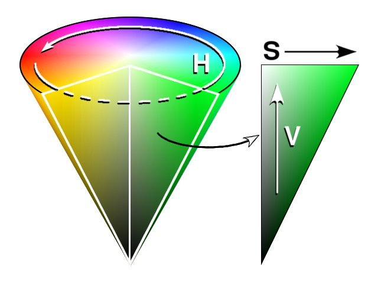
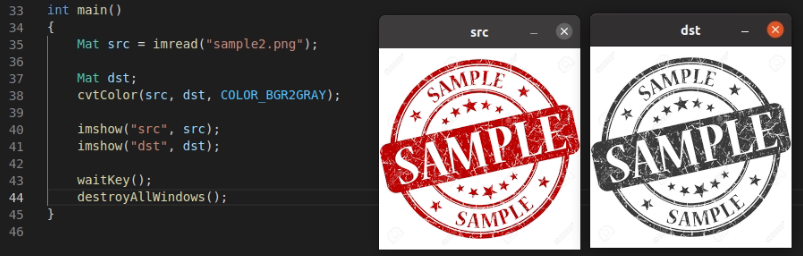
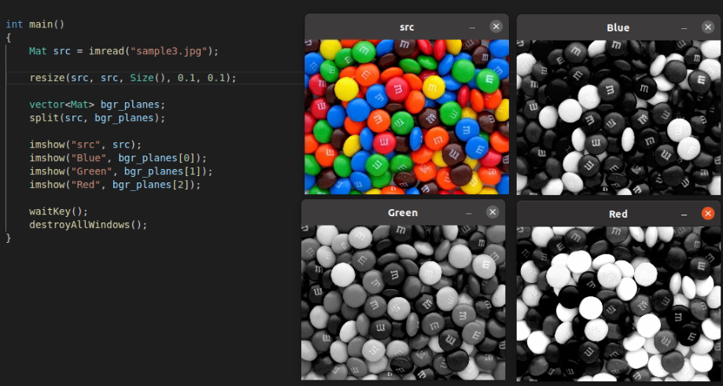
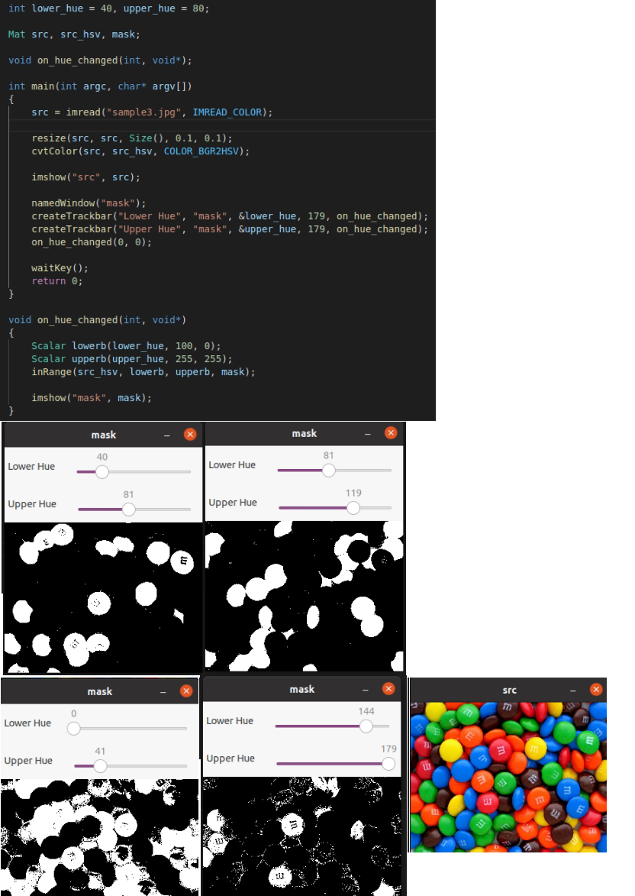
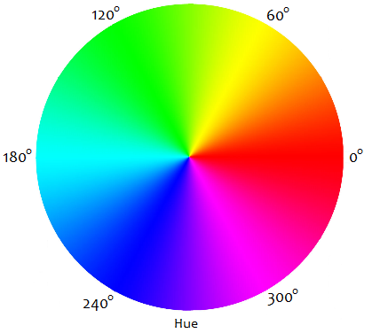

### 컬러 영상의 반전



- p1, p2는 각각 B, G, R을 참조로 받아온 값이다.
- 255 - p1, p2를 함으로 영상의 반전을 할 수 있다.


### 색 변환

- Y = aB + bG + cR

  - Y = 그레이스케일 성분의 크기, B = 파란색, G = 녹색, R = 빨간색


### HSV 색 모델



- HSV 색상은 색상, 채도 명도로 색을 표현하는 방식이다
  - 색상 = 색의 종류
  - 채도 = 색의 순도
  - 명도 = 빛의 세기
- OpenCV에서는 BGR2HSV 색 공간 변환을 이용해서 8비트 BGR 영상을 HSV 영상으로 변환할 수 있다.
  - H = 0~179
    - 360도의 각으로 표현되어야 하지만 uchar 자료형에서는 256 이상의 값을 표현할 수 없으므로 2로 나눈 H값을 사용한다.
  - S, V = 0 ~ 255  사이의 정수로 표현된다.


### 컬러영상을 그레이스케일로 변환



- COLOR_BGR2GRAY를 통해서 컬러 영상을 그레이스케일로 바꿀 수 있다.


### 색상 채널 나누기

```c++
void split(const Mat& src, Mat* mvbegin);
void split(InputArray src, OutputArrayOfArrays mv);
```

- src = 입력 다채널 행렬
- mvbegin = 분리된 1채널 행렬을 저장할 Mat 배열 주소. 이때 배열 개수는 src 영상 채널 수와 같아야함
- mv = 분리된 1채널 행렬을 저장할 벡터



- src 영상의 채널을 분할해서 bgr_planes 벡터에 저장하여 0에는 파랑, 1에는 녹색, 2에는 빨강을 지정한다.


### 색상 범위 지정에 의한 영역 분할

```c++
void inRange(InputArray src, InputArray lowerb, InputArray upperb, OuputArray dst);
```

- src = 입력 영상
- low, up = 하한, 상한 값. 주로 Mat, Scalar 객체 지정을 한다.
- dst = 출력 마스크 영상. 입력 영상과 크기가 같고, 타입은 CV_8UC1

$$
dst(x, y)=
\begin{cases}
255 & \mbox lower(x, y) \le \mbox src(x, y) \le upperb(x, y) \\
0 & \mbox{else}
\end{cases}
$$






- hue 영상 채널과 비교 하였을 때 필요한 영역을 잘라내서 검출하는 것을 확인할 수 있다.
