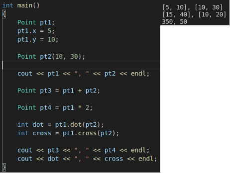
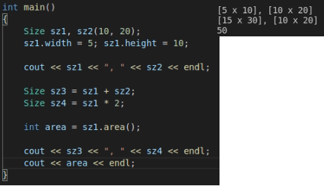
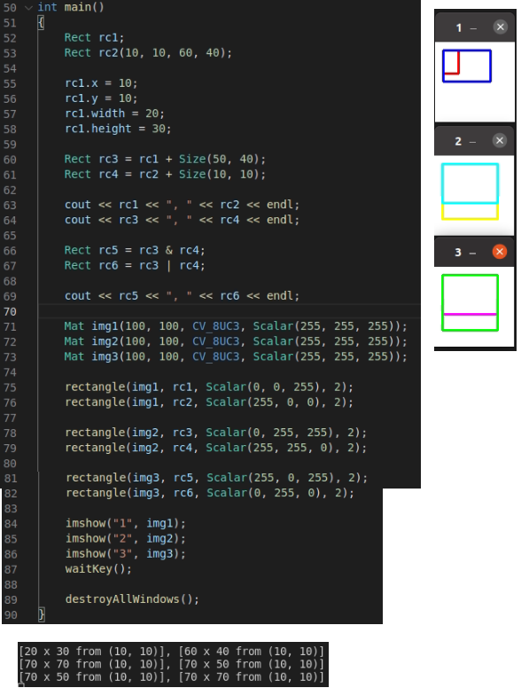
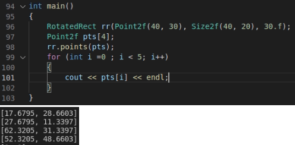
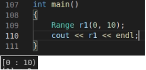
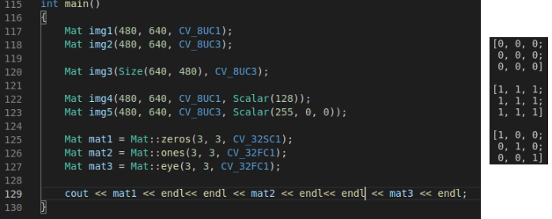
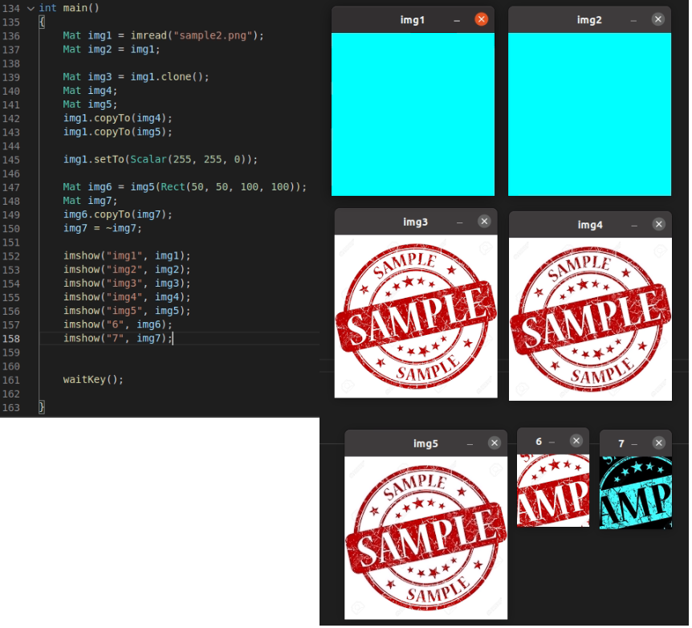

### Point_클래스

```c++
template<typename _Tp> class Point_
{
public:
    Point_();
    Point(_Tp _x, _Tp _y);
    Point_(const Point_& pt);  //기본생성자, 특정 인자를 받는 생성자, 복사 생성자
    
    Point_& operator = (const Point_& pt);	//연산자 재정의
    
    _Tp dot(const Point_& pt) const;	//내적
    double ddot(const Point_& pt) const;	//내적을 실수로 반환
    double cross(const Point_* pt) const;	//외적
    bool inside(cost Rect_<_Tp>& r) const;	//r 안에 좌표가 있으면 true 반환
    _Tp x, y;		//x, y 좌표
};

typedef Point_<int> Point2i;
typedef Point_<int64> Point2l;
typedef Point_<float> Point2f;
typedef Point_<double> Point2d;
typedef Point2i Point;		//다양한 자료형에 대한 포인트 클래스의 재정의
```



- pt1생성 - x = 5, y = 10으로 설정
- pt2 를 x = 10, y = 30인 상태로 생성
- pt3 = pt1 + pt2
- pt4 = pt1의 x, y값에 각각 두배씩 해줌
- dot = pt1와 pt2 의 내적 => 5x10 + 10x30 = 350
- cross = pt2와 pt2 의 외적 => 5x30 - 10x10 = 50

### Size_ 클래스

```c++
template<typename _Tp> class Size_
{
public:
    Size_();
    Size_(_Tp _width, _Tp _height);
    Size_(const Size_& sz);	//기본 생성자, 특정 인자를 받는 생성자, 복사 생성자
    
    Size_& operator = (const Size_& sz); //연산자 재정의
    
    _Tp area() const;	//weight x height 반환 = 면적
    bool empty() const;	//유효하지 않은 크기이면 true를 반환
    
    _Tp width, height;	//width = 가로, height = 세로
};

typedef Size_<int> Size2i;
typedef Size_<int64> Size2l;
typedef Size_<float> Size2f;
typedef Size_<double> Size2d;
typedef Size2i Size;	//다양한 자료형에 대한 Size 재정의
```



- sz1 생성 - width = 5, height = 10으로 설정
- sz2를 width = 10, height = 20으로 설정해서 생성
- sz3 = sz1 + sz2
- sz4 = sz1의 각각의 값에 2배씩 해줌
- area = sz1의 넓이 = width x height = 5 x 10 = 50

### Rect_ 클래스

```c++
template<typename _Tp> class Rect_
{
public:
    Rect_();
    Rect_(_Tp _x, _Tp _y, _Tp _width, _Tp _height);
    Rect_(const Rect_& r);
    Rect_(const Point_<_Tp>* org, const Size_<_Tp>& sz);
    Rect_(const Point_<_Tp>& pt1, const Point_<_Tp>& pt2;
          
    Rect_& operator = (const Rect_& r);
          
    Point_<_Tp> tl() const;
    Point_<_Tp> br() const;
    Size_<_Tp> size() const;
    _Tp area() const;
    bool empty() const;
    bool contains(const Point_<_Tp>& pt) const;
    
    _Tp x, y, width, height;	//x, y의 좌표, 가로 세로의 크기
};

typedef Rect_<int> Rect2i;          
typedef Rect_<float> Rect2f;
typedef Rect_<double> Rect2d;          
typedef Rect2i Rect;  
```



- rc1 생성 - x = 10, y = 10 width = 20, height = 30으로 설정
- rc2 x = 10, y = 10, width = 60, height = 40으로 설정하여 생성
- rc3 = rc1 + Size(50, 40)을 함. x, y는 변함 없음. width = 70, height = 70
- rc4 = rc2 + Size(10, 10)을 함. x, y는 그대로. width = 70, height = 50
- rc5 는 & 연산을 통해 겹쳐져 있는 영역만 반환
- rc6는 |연산을 통해 둘의 영역을 합쳐서 반환
- 이들의 이미지는 우측의 1, 2, 3번 이미지 창을 이용해서 확인해볼 수 있다.

### RotatedRect

```c++
class RotatedRect
{
public:
    RotatedRect();
    RotatedRect(const Point2f& _center, const Size2f& _size, float _angle);
    RotatedRect(const Point2f& point1, const Point2f& point2, 
                const Point2f& point3);	//생성자. 3가지 방식
    
    void points(Point2f pts[]) const;	//네 꼭지점 좌표를 저장함
    Rect boundingRect() const;	//회전된 사각형을 포함하는 최소 크기의 사각형 정보-정수
    Rect_<float> boundingRect2f() const;	//위의 기능을 실수로 반환
    
    Point2f center;
    Size2f;
    float angle;	//center = 사각형의 중심, size = 사각형의 크기
    				//angle = 시계방향 회전 각도
};
```



- (40, 30)을 중심으로 하고 (40, 20)의 크기를 가진 사각형을 30도만큼 회전
- pts에 회전시킨 이후의 꼭지점 4개를 반환받는다.

### Range

```c++
class Range
{
public:
    Range();
    Range(int _start, int _end);	//생성자. 시작점, 끝점 
    								//start는 범위에 포함. end는 포함 안된다.
    
    int size() const;		//end - start 크기를 반환
    bool empty() const;		//start == end 면 true 반환
    static Range all();
    
    int start, end;
};
```



- 0은 포함되고 10은 포함 안됨에 유의

### MAT

```c++
int main()
{
	Mat img1(480, 640, CV_8UC1);	//흑백 640x480
    Mat img2(480, 640, CV_8UC3);	//컬러 640x480
    
    Mat img3(Size(640, 480), CV_8UC3);	//img2는 이와 같이 표현할 수도 있다.

    Mat img4(480, 640, CV_8UC1, Scalar(128));	//Grayscale 128 640x480
    Mat img5(480, 640, CV_8UC3, Scalar(255, 0, 0));	//Blue 640x480
        
    Mat mat1 = Mat::zeros(3, 3, CV_32SC1); //3x3 0행렬
    Mat mat2 = Mat::ones(3, 3, CV_32FC1);	//1로 구성
    Mat mat3 = Mat::eye(3, 3, CV_32FC1);	//단위행렬
}
```



- mat1, 2, 3이 각각 0, 1, 단위행렬 3x3의 크기로 구성되어 있는 것을 확인 가능

### 행렬의 복사 및 추출



- 이미지 객체 img1 생성
- 이를 직접적으로 img2에 대입하여 복사
- clone, copyTo를 이용하여 각각 img3, 4에 복사
- 이후 BGR값 (255, 255, 0)으로 이미지를 편집할 시 img1, img2는 얕은 복사로 인해 색의 변경
- 그러나 img3, 4는 새로 생성된 것이므로 영향 x
- img6은 img5에서 50, 50 위치에서 100, 100 만큼의 크기를 추출하여 만든 이미지
- 이를 copyTo를 통해 7을 만들고 이미지를 반전시킴
  - copyTo를 통해 만들었으므로 img5에는 영향 x
