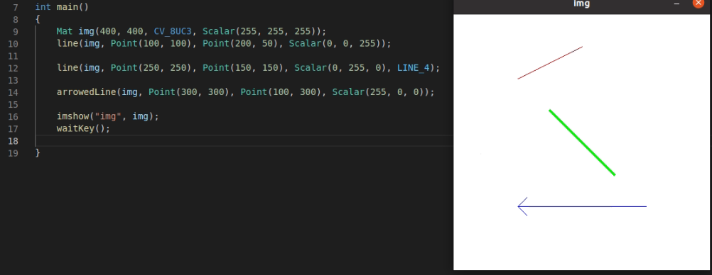
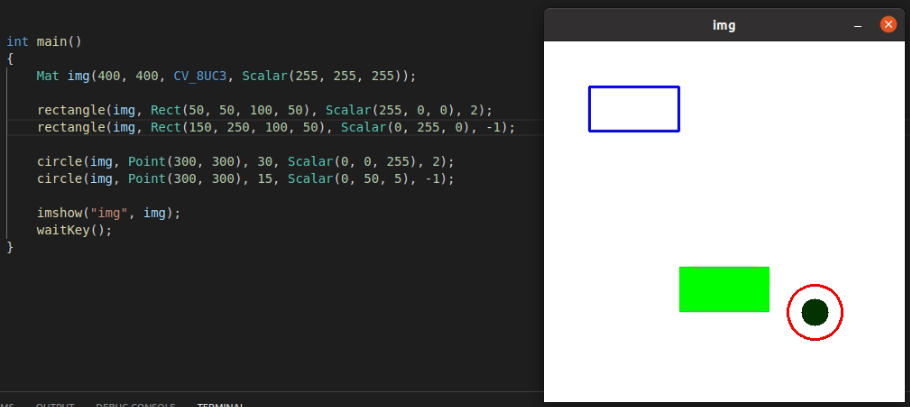
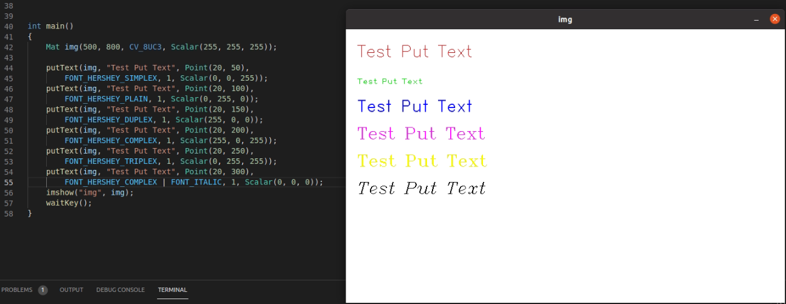
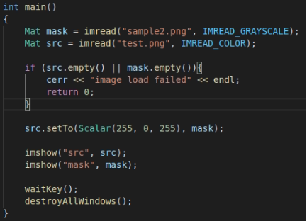

# Chap 4

OpenCV 주요 기능


### 직선 그리기

```c++
void line(InputOutputArray img, Point pt1, Point pt2, const Scalar& color, int thickness = 1, 
          int lineYtpe = LINE_8, int shift = 0);
```

- img - 입출력 영상
- pt1 = 시작점
- pt2 = 끝점
- color 선 색상(또는 밝기(grayscale))
- thickness = 선 두께
- lineType = 선 타입( LINE_4, LINE_8, LINE_AA 중 하나를 지정)
- shift(그리기 좌표 값의 축소 비율(우측 비트쉬프트(>>)연산))
- LineTypes 열거형 상수
  - FILLED = -1 내부를 채움 - 직선 그리기 함수에는 사용 불가
  - LINE_4 = 4 4방향 연결
  - LINE_8 = 8 8방향 연결
  - LINE_AA = 안티에일리어싱

```c++
void arrowedLine(InputOutputArray img, Point pt1, Point pt2, const Scalar& color, int thickness = 1,
                int line_type=8, int shift = 0, double tipLength = 0.1);
```

- line과 똑같은 인자들
- tipLength = 전체 길이에 대한 화살표 길이의 비율

```c++
void drawMarker(InputOutputArray img, Point position, const Scalar& color, int markerType = MARKER_CROSS,
               int markerSize = 20, int thickness = 1, int line_type = 8);
```

- position = 마커 출력 위치
- markerType = 마커 종류, MarkerTypes 열거형 상수 중 하나를 지정
- markerSize = 마커 크기



- 10) line (100, 100)~(200, 50) 빨간색으로 그림

  12. line (250, 250) ~ (150, 150) 녹색으로 그림

  14. arrowedLine(300, 300) ~ (100, 300) 파란색으로 그림


### 도형 그리기

```c++
void rectangle(InputOutputArray img, Point pt1, Point pt2, const Scalar& color, int thickness = 1,
              int lineType = LINE_8, int shift = 0);
//Point pt1, Point pt2 는 Rect rec로 대체될 수 있다.
```

- pt1, 2 서로 대각의 위치에 있는 사각형 꼭지점 좌표
- rec = 사각형 위치 정보
- thickness = -1 일 때 내부 채우기가 적용

```c++
void circle(InputOutputArray img, Point center, int radius, const Scalar& color, int thickness = 1,
           int lineType = LINE_8, int shift = 0);
```

- center = 원의 중심
- radius = 바지름
- thickness = -1 일때 내부 채우기가 적용

```c++
void ellipse(InputOutputArray img, Point center, Size axes, double angle, double startAngle, double endAngle, 
            const Scalar& color, int thickness = 1, int lineType = LINE_8, int shift = 0)
```

- axes = 타원의 반지름(x축 반지름, y축 반지름)
- angle(타원 회전 각도 x축 방향)
- startAngle(타원 호의 회전각도, 시계 방향)
- endAngle(타원 호의 끝 각도(시계 방향))

```c++
void polylines(InputOutputArray img, InputArrayOfArrays pts, bool is Closed, const Scalar& color, int thickness = 1
              int lineYtpe = LINE_8, int shift = 0);
```

- pts = 다각형 외곽 점들의 좌표 배열
- isClosed 다각형이 닫혀있는지를 나타내는 플래그. true면 다각형의 마지막 꼭지점과 첫번째 꼭지점을 잇는 직선을 추가로 그림



- 속이 빈 사각형을 파란색으로 그리기
- 속이 찬 사각형을 녹색으로 그리기
- 속이 빈 원을 빨간색으로 그리기
- 속이 찬 원을 (5, 50, 0) - RGB 기준 으로 그리기


### 글씨 쓰기

```c++
void putText(InputOutputArray img, const String& text, Point org, int fontFace, double fontScale, Scalar color,
            int thickness = 1, int lineType = LINE_8, bool bottomLeftOrigin = False)
```

- text = 출력할 문자열
- org = 영상에서 문자열을 출력할 위치의 좌측 하단 좌표
- fontFace = 폰트 종류. cv::HersheyFonts에서 선택
- fontScale = 폰트 크기 확대/축소 비율
- color = 문자열 색상
- thickness = 문자열을 그릴 때 사용할 선 두께



- 44~53 - 각각의 글씨체를 적용, 색상을 적용하여 Test Put Text를 출력하였다.
- 54~55 - FONT_HERSHEY_COMPLEX 와 FONT_ITALIC을 |(or)연산을 통해 중첩하여 기울인 FONT_HERSHEY_COMPLEX를 만들어 출력하였다.


### 마우스 이벤트

```c++
void setMouseCallback(const String& winname, MouseCallback onMouse, void* userdata = 0);
```

- winname  = 마우스 이벤트 처리를 할 창의 이름
- onMouse  = 마우스 이벤트 처리를 위한 콜백 함수 이름
- userdata = 콜백 함수에 전달할 사용자 데이터의 포인터


### 마스크 연산

```c++
Mat& Mat::setTo(InputArray value, InputArray mask = noArry());
```

- value 행렬 원소에 설정할 값
- mask 마스크 행렬. 마스크 행렬의 원소가 0이 아닌 위치에서만 value 값이 설정된다. 행렬 전체 원소값을 설정하려면 noArray() 또는 Mat()를 지정한다.

