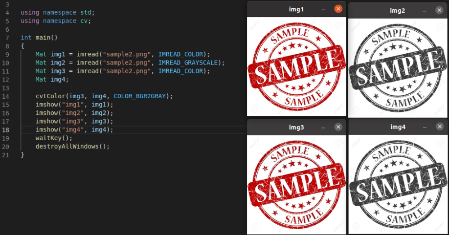
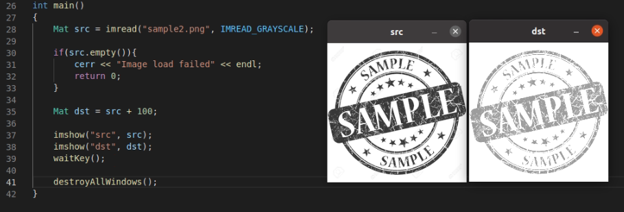
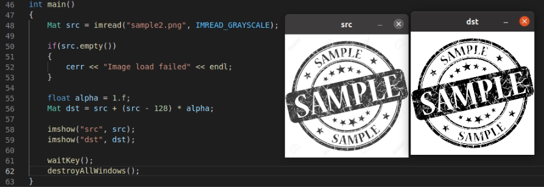
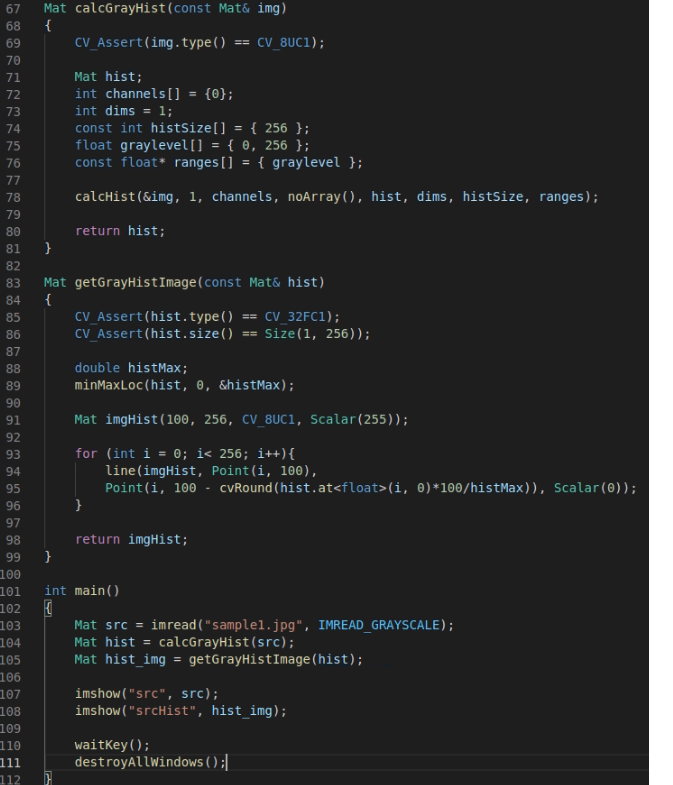
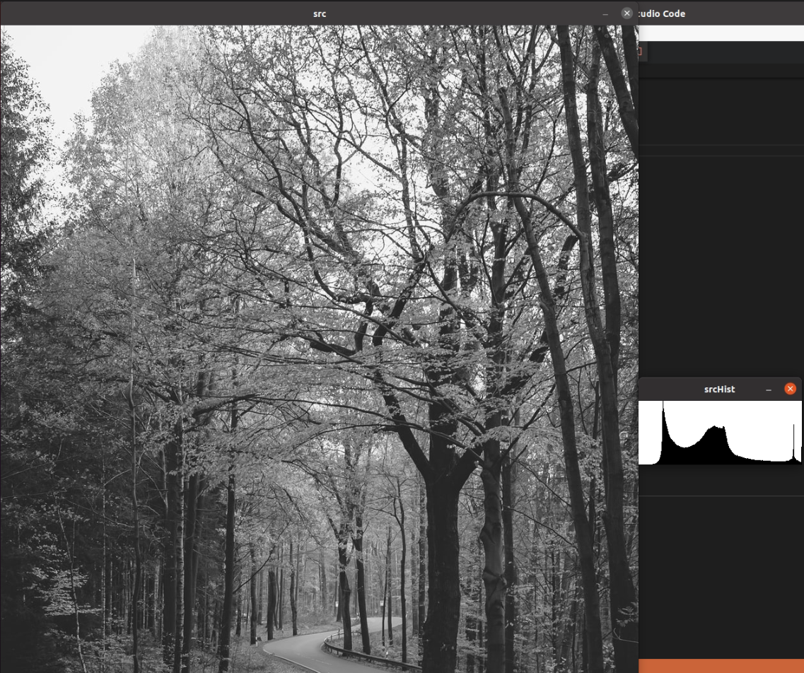
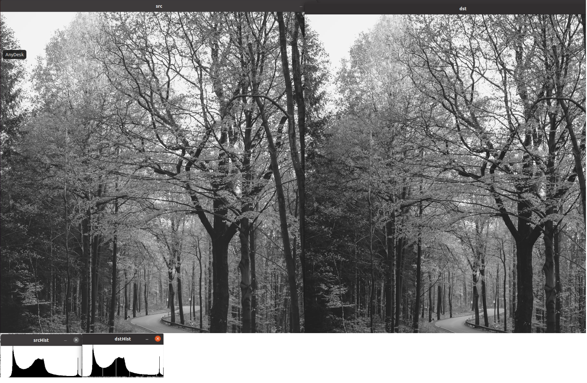
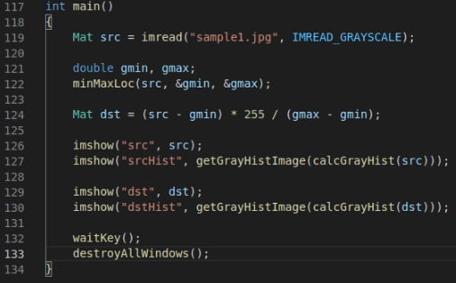
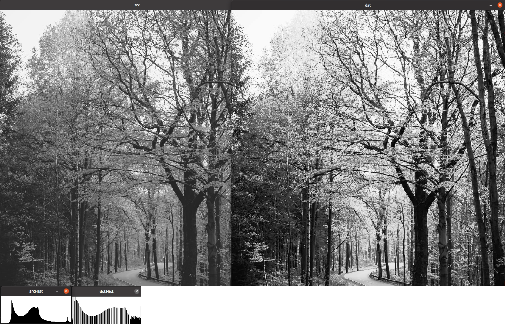
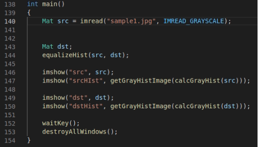

# Chap 5

### 그레이스케일



- img1, img2 는 imread를 통해 color, grayscale을 통해 불러왔다.
- img3은 color를 통해 불러온 이미지이며 img4는 img3를 cvtColor 함수를 통해 gray로 바꿔서 불러왔다.


### 밝기 조절



1. src를 grayscale로 불러옴
2. dst를 src 에 100만큼의 픽셀값을 더해서 생성함
3. 로딩하였을때 src에 비해 dst가 더 밝은 모습을 확인할 수 있다.




1. src를 grayscale로 불러옴
2. 56번째 줄 src의 픽셀 값에 src - 128을 한 값을 더해서 dst 이미지를 만듬
3. 그 결과 어두운 부분은 더 어두워지고 밝은 부분은 더 밝아진 모습을 볼 수 있다.
   - 128인 이유 : 0~255 픽셀 사이의 값에서 중간 값이 128이다.


### 히스토그램

```c++
void calcHist(const Mat* images, int nimages, const int* channels, InputArray mask, OutputArray hist, int dims,
             const int* histSize, const float** ranges, bool uniform = true, bool accumulate = false);
```

- images = 입력 영상의 배열 또는 주서. 영상의 배열일 경우 모든 영상의 크기와 깊이는 동일해야한다.
- nimages = 입력 영상 개수
- channels =히스토그램을 구할 채널을 나타내는 정수형 배열
- mask = 마스크 영상. 입력 영상과 크기가 같은 8비트 배열
- hist = 출력 히스토그램 CV_32F depth를 사용하는 dims - 차원의 행렬이다.
- dims = 출력 히스토그램 차원의 수
- histSize = 각 차원의 히스토그램 배열 크기를 나타내는 배열
- ranges = 각 차원의 히스토그램 범위
- uniform = 히스토그램 빈의 간격이 균등한지를 나타내는 플래그
- accumulate = 누적 플래그





calcGrayHist - 그레이 스케일 영상의 히스토그램 구하기

calcGrayHistImage - 구한 히스토그램을 이용한 그래프 그리기


### 히스토그램 스트레칭

$$
dst(x, y) = {255\over G_{max} - G_{min}} \cross (src(x, y) -G_{min})
$$

G_max = 원본 이미지의 최대 Grayscale 값

G_min = 원본 이미지의 최소 Grayscale 값

범위를 최대 - 최소를 해서 모든 값들을 0~1 사이가 나오게 해주고 난 이후 밝기값 0~255 를 맞추기 위해 255를 곱해준다.





- getGrayHIstImage, calcGrayHist 는 위에서 사용한 것과 동일한 함수로 각각 히스토그램 구하기, 구한 히스토그램으로 그래프를 그리는 함수다.
- 사용한 이미지의 밝기가 골고루 분포되어 있어 히스토그램 스트레칭의 효과를 크게 볼수는 없지만 그래프를 통해 확인해볼 때 중간중간 dstHist의 빈 영역을 볼 수있다.
  - 이 영역을 근처로 해서 스트레칭이 이루어졌다는것을 유추할 수 있다.


### 히스토그램 평활화

```c++
void equalizeHist(InputArray src, OutputArray dst);
```

$$
H(g) = \sum_{0\le i\le g}h(i)
\\dst(x, y) = round(H(src(x, y)) \cross { L_{max}\over N})
$$

L_max = 그레이스케일의 최대 밝기 = 255

N = 총 픽셀 수





- 그래프의 20~50%의 해당하는 영역이 0~80% 로 골고루 퍼짐에 따라 이미지가 보다 더 선명해진것을 볼 수 있다.
  - 꽃들의 영역이 상당히 선명해진것을 확인 가능