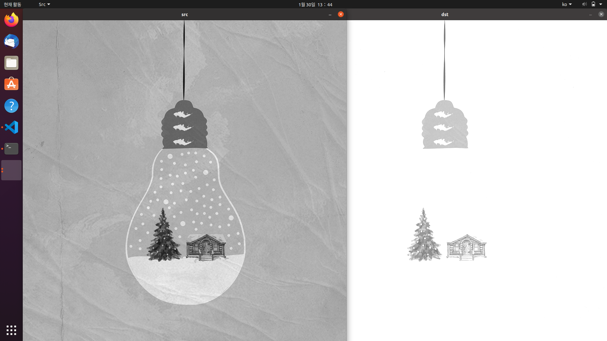
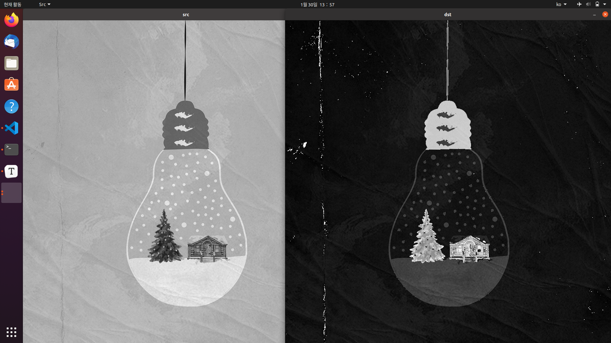
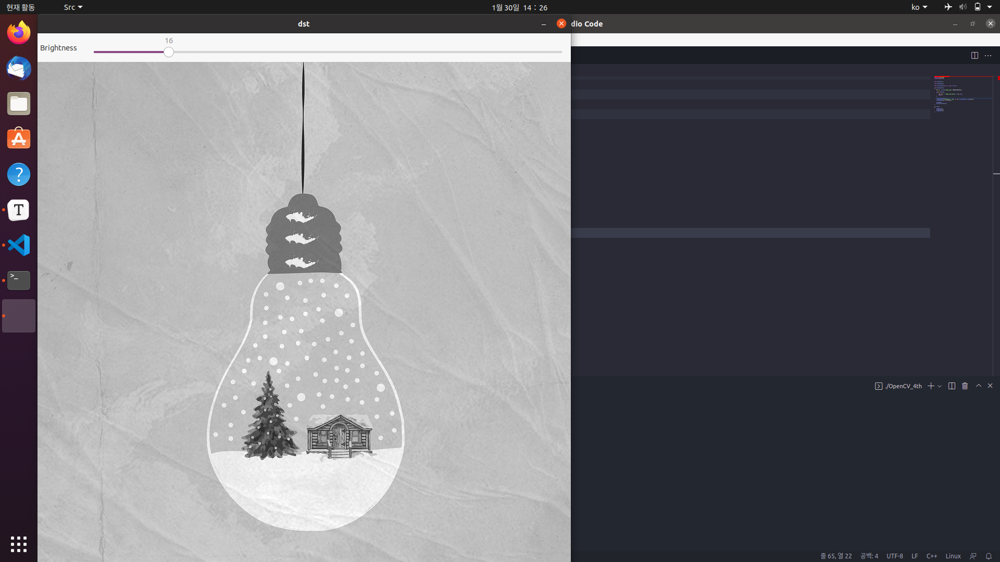
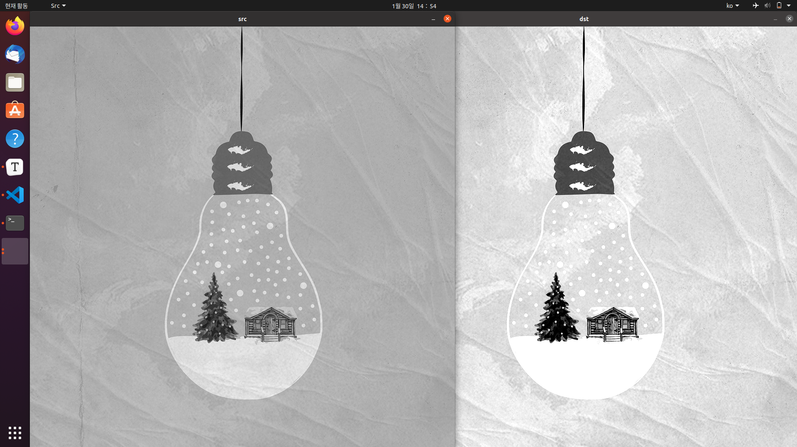
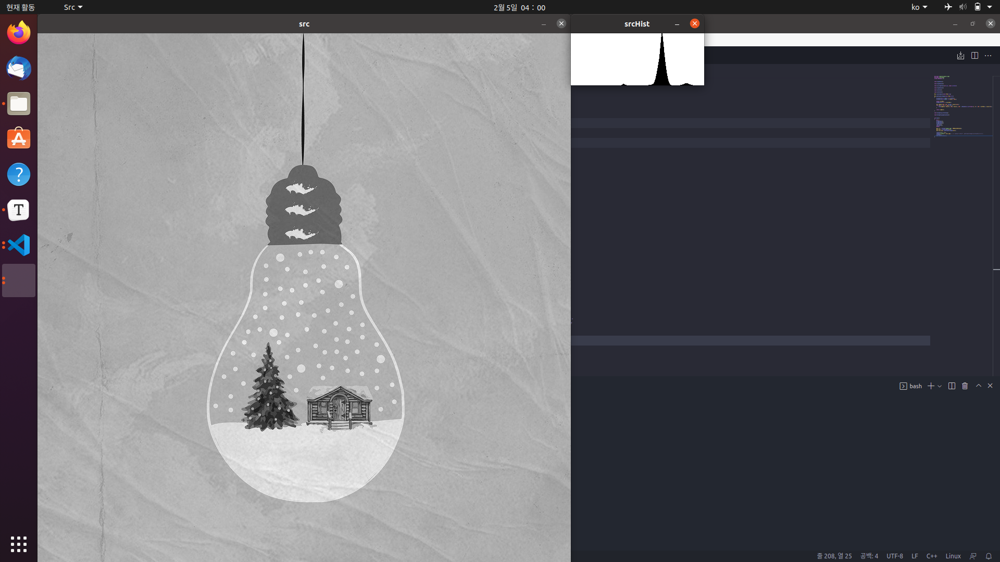
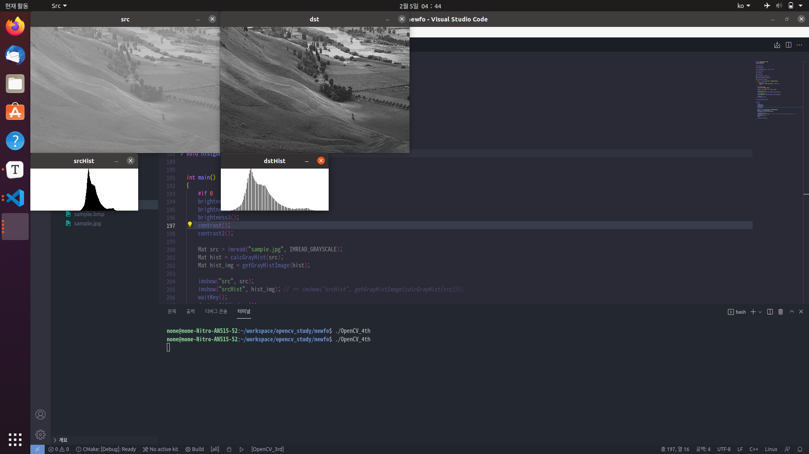
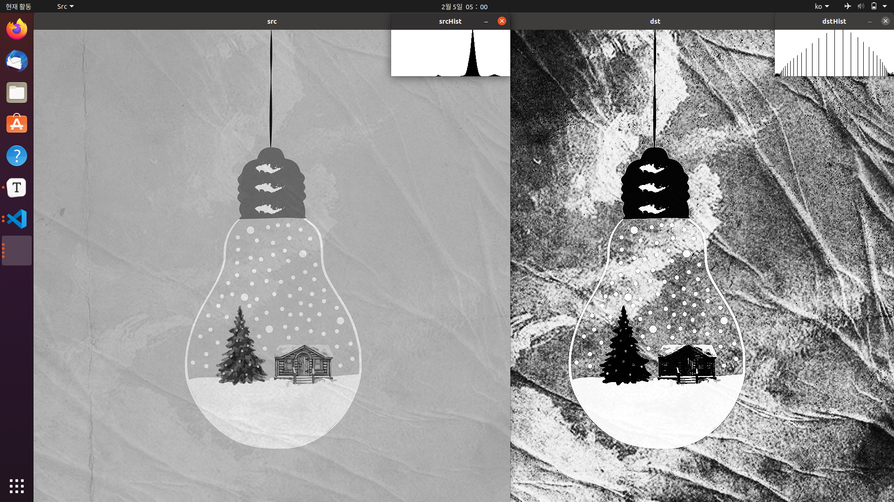

# 영상의 밝기 조절

> 디지털 카메라로 사진을 찍다 보면 조금 어둡거나 너무 밝게 사진이 찍히는 경우가 있다. 이러한 경우, 행렬의 덧셈과 뺼셈을 이용하여 간단한 영상 처리 기법으로 적정 밝기의 사진으로 보정할 수 있다. 이번 장에서는 OpenCV에서 제공하는 밝기 조절 기법과 사용자가 직접 영상의 밝기에 관여하는 방법, 트랙바를 사용하여 밝기를 조정하는 방법에 관하여 다루겠습니다


## 그레이 스케일 영상 다루기


+ 대부분의 영상 처리 알고리즘은 컬러 영상이 아니라 그레이 스케일 영상을 대상으로 한다. (컬러 영상도 그레이 스케일로 변환하여 처리한다)

  > 1. 과거에 개발되었던 많은 영상 처리 알고리즘이 주로 그레이 스케일로 개발되었다.
  > 2. 컬러 영상을 그레이 스케일에 비해서 3배 많은 메모리와 연산 시간을 필요로 한다.

```C++
Mat img = imread("Sample.jpg", IMREAD_GRAYSCALE); // 그레이 스케일 영상
Mat GrayedImage(480, 640, CV_8UC1, Scalar(0)); // 640 X 480 싱글채널 Unsigned Character 0으로 초기화된 행렬
img = imread("Sample.jpg", IMREAD_COLOR); // 컬러 영상
cvtColor(img, GrayedImage, COLOR_BGR2GRAY); // img에 저장된 컬러 영상을 GrayedImage에 그레이 스케일로 삽입
```

+ OpenCV 함수 중에서는 컬러 영상이나 그레이 스케일 영상 중에서 하나의 타입만을 받을 수 있는 함수도 있습니다. 따라서, 전달받는 인자의 형식을 항상 주의하여 사용하여야 합니다.


### OpenCV


+ 영상의 밝기 조절을 하기 위해서는 모든 픽셀에 양수를 더하거나 빼주어서 영상을 밝거나 어둡게 만들 수 있습니다.

+ OpenCV에서는 영상의 밝기 조절을 할 때, 포화 연산(밝기의 최댓값인 255보다 커지거나 최솟값인 0보다 작아지는 것을 방지하는 연산)을 적용합니다.

  > dst(x, y) = saturate(src(x, y) + n)
  >
  > src(x, y) + n > 255 => 255
  >
  > src(x, y) + n < 0 => 0
  >
  > 0 <= src(x, y) + n <= 255 => src(x, y) + n

``` C++
void brightness()
{
    Mat src = imread("sample.jpg", IMREAD_GRAYSCALE); // GrayScale로 영상 불러오기
    
    if(src.empty())
    {
        cerr << "Image load failed." << std::endl;
        return;
    }
    
    Mat dst = src + 100; // 행렬의 모든 원소에 100을 더하는 연산자 오버로딩
    imshow("src", src); // src창에서 src이미지 띄우기
    imshow("dst", dst); // dst창에서 dst이미지 띄우기
    waitKey();
    
    destroyAllWindows();
}
```




### 사용자 구현

> OpenCV에서 제공하는 연산자가 아니라 사용자가 직접 구현하는 방식의 밝기 조절 코드 작성 방식을 알아본다.


``` C++
void brightness2()
{
    Mat src = imread("sample.jpg", IMREAD_GRAYSCALE);
    
    if(src.empty())
    {
        std::cerr << "Image load failed" << endl;
        return;
    }
    
    Mat dst(src.rows, src.cols, src.type()); // src의 rows, cols, type을 직접적으로 받아서 dst 행렬 생성
    
    for (int j = 0; j < src.rows; j++)
        for (int i = 0; i < src.cols; i++)
            dst.at<uchar>(j, i) = src.at<uchar>(j, i) + 100; // 반복 연산으로 해당하는 픽셀 하나 하나에 100을 더함
    
    imshow("src", src);
    imshow("dst", dst);
    waitKey();
    
    destroyAllWindows();
}
```



+ 위에서 실행한 코드의 결과를 살펴보면, 포화연산이 적용되지 않아서 밝아져야 할 부분이 어둡게 나타난 것을 볼 수 있다. 이는 255를 넘어가는 값에 대해서는 다시 1부터 카운트되기 때문이다.
+ 따라서, 이 코드를 정상적으로 구현하기 위해서는 for 반복문을 다음과 같이 변경해주어야 한다.

``` C++
    for (int j = 0; j < src.rows; j++)
        for (int i = 0; i < src.cols; i++)
            int v = src.at<uchar>(j, i) + 100;
            dst.at<uchar>(j, i) = v > 255 ? 255 : v < 0 ? 0 : v;
```

+ 또한, 여기서 OpenCV에서 제공하는 saturate_cast()함수를 이용하여 포화연산을 해줄 수 있다. saturate_cast()함수는 다음과 같이 생겼다

``` C++ 
template<> inline
uchar saturate_cast<uchar>(int v); // v값에 대해서 포화연산을 적용하여 반환합니다.
```


### 트랙바 사용

> 트랙바를 사용하여 영상의 밝기를 조절하는 방법


+ 트랙바를 이용하여 실시간으로 밝기를 조절하고 그 결과를 확인할 수 있습니다.

``` C++
void on_brightness(int pos, void* userdata)
{
    Mat src = *(Mat*)userdata;
    Mat dst = src + pos;
    
    imshow("dst", dst);
}

void brightness3()
{
    Mat src = imread("sample.jpg", IMREAD_GRAYSCALE);
    
    if(src.empty())
    {
        std::cerr << "Image load failed" << std::endl;
        return;
    }
    
    namedWindow("dst");
    createTrackbar("Brightness", "dst", 0, 100, on_brightness, (void*)&src);
    on_brightness(0, (void*)&src);
    
    waitKey();
    destroyAllWindows();
}
```




## 영상의 명암비 조절


+ 영상의 명암비 조절은 밝기 조절과 달리 모든 행렬에 대해서 하나의 값을 더하거나 빼는 형태가 아니라 전체 픽셀에 적절한 실수를 곱하는 연산입니다.

+ 명암비란 영상에서 밝은 영역과 어두운 영역 사이에 드러나는 밝기 차이의 강도를 의미하고, 명암대비 또는 콘트라스트라고도 합니다. 영상이 전반적으로 밝거나 어두운 경우, 명암비가 낮다고 표현하고, 반대로 밝은 영역과 어두운 영역의 차이가 클 경우에는 명암비가 높다고 표현합니다.

+ 일반적으로 명암비가 낮으면 객체 간의 구별이 힘들어서 전반적으로 흐릿하게 느껴지고, 명암비가 높으면 선명하게 느껴집니다.

+ 다음은 기본적인 명암비 조절 수식입니다.

  > dst(x, y) = saturate(s * src(x, y))
  >
  > 곱해서 나오는 값이 25보다 커질 수 있으므로, 포화 연산을 적용합니다.


### 기본적인 명암비 조절 수식으로 인한 결과


``` c++
void contrast()
{
    Mat src = imread("sample.jpg", IMREAD_GRAYSCALE);
    
    if(src.empty())
    {
        std::cerr << "Image load failed" << std::endl;
        return;
    }

    float s = 2.f;
    Mat dst = s * src; // 연산자 오버로딩으로 행렬 곱하기
    imshow("src", src);
    imshow("dst", dst);

    waitKey();
    destroyAllWindows();
}
```


+ 그러나 너무 기본적인 명암비 조절 수식을 사용할 경우, 전반적으로 어두워지거나 너무 쉽게 포화되는 단점이 있습니다.


### 효과적인 명암비 조절 방법


+ 좀 더 효과적으로 명암비를 조절하기 위해서는 밝은 픽셀은 더 밝게, 어두운 픽셀은 더 어둡게 변경할 필요가 있습니다. 이 때, 픽셀값이 어둡고 밝은지를 어떻게 설정할지가 명암비 조절 결과 영상의 품질 파이를 가져옵니다.

+ 일반적으로 사용되는 방식으로는 128을 가운데 값으로 지정하거나, 입력 영상의 평균 밝기를 구해서 사용합니다. 이번에는 128을 기준값으로 코드를 작성해보겠습니다.

+ 128을 기준으로 사용하기 위해서 필요한 수식은 다음과 같습니다.

  > dst(x, y) = saturate(src(x, y) + (src(x, y) - 128) * a)
  >
  > a는 -1 이상의 실수리고, 항상 (128, 128)을 지나가고 a에 의해서 기울기가 결정되는 직선의 방정식입니다.
  >
  > a가 0보다 작으면 명암비를 감소시키는 변환 함수가 되고, 0보다 크면 명암비를 증가시키는 변환 함수가 됩니다.

``` C++
void contrast2()
{
    Mat src = imread("sample.jpg", IMREAD_GRAYSCALE);

    if(src.empty())
    {
        std::cerr << "Image load failed" << std::endl;
        return;
    }

    float alpha = 1.f;
    Mat dst = src + (src - 128) * alpha;

    imshow("src", src);
    imshow("dst", dst);

    waitKey();
    destroyAllWindows();
}
```




## 히스토그램 분석

> 지금까지는 사용자가 지정한 픽셀 값 변환 함수를 적용하여 밝기과 명암비를 조절했다면, 이번에는 주어진 영상의 픽셀의 밝기 분포를 조사하여 밝기 및 명암비를 적절하게 조절하는 방법에 대해 알아보겠습니다.


### 히스토그램 구하기


+ 히스토그램이란 영상의 픽셀 값 분포를 그래프 형태로 표현한 것입니다.
+ 그레이스케일 영상의 경우, 각 그레이스케일 값에 해당하는 픽셀의 개수를 구하고 이를 막대 그래프 형태로 표현함으로써 히스토그램을 구할 수 있습니다.

+ 이 때, 히스토그램 그래프에서 가로축을 히스토그램의 빈이라고 합니다. 보통의 그레이스케일 영상은 256개의 빈을 갖습니다.(0 ~ 255)

+ 빈의 개수가 줄어들면 히스토그램이 표현하는 영상의 픽셀 값 분포 모양이 좀 더 대략적이 형태로 바뀝니다.
+ OpenCV에서는 영상의 히스토그램을 구하기 위해서 calcHist()함수를 사용합니다. calcHist()함수의 원형은 다음과 같습니다.

``` C++
void calcHist(const Mat* images, int nimages, const int* channels, InputArray mask, OutputArray hist, int dims, const int* histSize, const float** ranges, bool uniform = true, bool accumulate = false); // images와 nimages로 입력할 영상의 배열의 주소와 개수를 전달하고 channels로 히스토그램을 구할 채널을 나타내는 정수형 배열을 전달해줍니다. mask를 받아서 마스크 연산을 수행할 수 있습니다. CV_32F의 깊이를 갖는 dims 차원 행렬의 hist를 출력하고, histSize를 통하여 빈의 개수를 설정해줍니다. ranges는 각 차원의 히스토그램 범위를 의미하고, uniform으로 빈의 간격을 균등하게 정하고, accumulate로 hist배열을 초기화할지 여부를 정할 수 있습니다. uniform의 초기값은 균등하게이고, accumulate의 초기값은 누적 안함입니다.
```


### 그레이 스케일의 히스토그램 구하기

``` C++
Mat calcGrayHist(const Mat& img)
{
	CV_Assert(img.type() == CV_8UC1); // 영상이 그레이스케일인지 판별

	Mat hist; // 영상 선언
	int channels[] = { 0 }; // 채널의 깊이 설정
	int dims = 1; // 구해지는 행렬이 1차원 행렬임을 설정
	const int histSize[] = { 256 }; // 채널을 256개의 빈으로 나눔
	float graylevel[] = { 0, 256 }; // 최솟값, 최댓값 지정
	const float* ranges[] = { graylevel }; // graylevel이름 저장

	calcHist(&img, 1, channels, noArray(), hist, dims, histSize, ranges); // 1의 깊이를 가지는 img 한 개를 마스킹 없이 256개의 빈으로 나눔

	return hist;
}

Mat getGrayHistImage(const Mat& hist)
{
	CV_Assert(hist.type() == CV_32FC1); // 1의 깊이를 가지는 double형인지 판변
	CV_Assert(hist.size() == Size(1, 256)); // 최솟값과 최댓값이 1~256인지 판별

	double histMax;
	minMaxLoc(hist, 0, &histMax); // 히스토그램의 최댓값을 저장

	Mat imgHist(100, 256, CV_8UC1, Scalar(255)); // 100 X 256으로 1개의 UC형 흰 색 영상 설정
	for (int i = 0; i < 256; i++) {
		line(imgHist, Point(i, 100), Point(i, 100 - cvRound(hist.at<float>(i, 0) * 100 / histMax)), Scalar(0));
        // 그래프의 최대 길이는 100으로 설정하고, 반복문으로 히스토그램의 막대 그래프 출력
	}

	return imgHist;
}
```




### 히스토그램 스트레칭

> 보통 명암비가 낮은 영상은 히스토그램이 특정 구간에 나타나게 되는데, 명암비를 높이기 위해서 이를 전 구간에 걸쳐 나타나도록 변경하는 선형 변환 기법입니다. 


+ 히스토그램 스트레칭을 수식으로 나타내면 다음과 같습니다.

  > dst (x, y) = 255 * (src(x, y) - G<sub>min</sub>)   / G<sub>max</sub> - G<sub>min</sub> 
  >
  > G<sub>max</sub>와 G<sub>min</sub>은 가장 큰 그레이스케일값과 가장 작은 그레이스케일값을 나타냅니다. 이 때, G<sub>min</sub>을 0, G<sub>max</sub>를 255로 설정하면 히스토그램이 전 구역에 걸쳐서 나타나게 되는데 이를 히스토그램 스트레칭이라 합니다.

+ 히스토그램 스트레칭은 OpenCV에서 제공하지 않지만, 연산자 오버로딩을 통하여 쉽게 만들 수 있습니다.

``` C++
void histgoram_stretching()
{
	Mat src = imread("sample.jpg", IMREAD_GRAYSCALE); // 그레이스케일 영상 생성

	if (src.empty()) {
		std::cerr << "Image load failed!" << std::endl;
		return;
	}

	double gmin, gmax;
	minMaxLoc(src, &gmin, &gmax); // 최댓값, 최솟값 설정

	Mat dst = (src - gmin) * 255 / (gmax - gmin); // 히스토그램 스트레칭 수식

	imshow("src", src);
	imshow("srcHist", getGrayHistImage(calcGrayHist(src)));

	imshow("dst", dst);
	imshow("dstHist", getGrayHistImage(calcGrayHist(dst)));

	waitKey();
	destroyAllWindows();
}	
```




### 히스토그램 평활화

> 특정 구역에서 히스토그램 값이 너무 뭉쳐있을 때, 뭉쳐있는 값을 전체 영역에서 골고루 나타나도록 변경하는 알고리즘 중 하나입니다.


+ 히스토그램 평활화의 수식을 나타내면 다음과 같습니다.

  > dst(x, y) = round(H(src(x, y)) * L<sub>max</sub> / N)
  >
  >  H(g)는 히스토그램의 누적 함수이고, L<sub>max</sub>는 영상이 가질 수 있는 최대 밝기 값을 의미합니다.round()함수는 반올림 함수입니다.

+ OpenCV에서 제공하는 평활화 함수는 다음과 같습니다.

``` C++
void equalizeHist(InputArray src, OutputArray dst); // 8비트 1채널 입력 영상 src를 받아서 같은 영상의 dst로 내보냅니다.
```

``` C++
void histgoram_equalization()
{
	Mat src = imread("sample.jpg", IMREAD_GRAYSCALE);

	if (src.empty()) {
		std::cerr << "Image load failed!" << std::endl;
		return;
	}

	Mat dst;
	equalizeHist(src, dst);

	imshow("src", src);
	imshow("srcHist", getGrayHistImage(calcGrayHist(src)));

	imshow("dst", dst);
	imshow("dstHist", getGrayHistImage(calcGrayHist(dst)));

	waitKey();
	destroyAllWindows();
}
```


