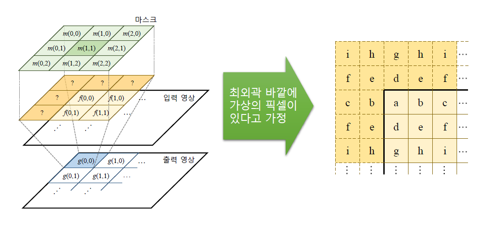

# Filtering

영상처리에서 Filtering이란 원하는 정보만 통과시키고 원하지 않는 정보는 걸러내는 작업이다

예를들어 이미지의 Noise를 걸러내어 영상을 더 깔끔하게 만드는 필터가 있다.


일반적으로 필터는 mask 라고 부르는 작은 크기의 행렬을 이용한다.(kernel, window라고 불리기도 함)


- mask의 예시

  - 상황에 따라서 가로로 긴 3x1 형태를 사용할 수도, 세로로 긴 1x3 형태를 사용할 수도, 십자 모양이나 사용자 임의로 크기 조절을 할 수 있다.

- 제일 많이 사용되는 3x3 정방형의 연산 방식은 다음과 같다.
  $$
  g(x, y) = \\m(0, 0)f(x-1, y-1)+m(1, 0)f(x, y-1)+m(2, 0)f(x+1, y-1)\\m(0, 1)f(x-1, y)+m(1, 1)f(x, y)+m(2, 1)f(x+1, y)\\m(0, 2)f(x-1, y+1)+m(1, 2)f(x, y+1)+m(2, 2)f(x+1, y+1)
  $$

  - 이때 f, g는 각각 입력 영상, 출력 영상을 의미하며 m은 마스크 행렬을 의미한다.
    - 행렬 개개의 원소가 각 좌표에 일치하는 마스크 행렬의 값과 연산이 되어서 처리됨


- 3x3 기준 위의 그림과 같이 연산이 수행되며 g(x, y)는 시그마를 통해서 짧게 작성할 수 있다.

- 단 필터링 연산을 수행할 시 mask의 중심점이 이미지의 가상에 위치하여 mask의 범위가 기존 이미지 밖으로 벗어나는 상황이 발생한다.

  - 이를 위해 Bordertype이라는 변수가 존재하며 이를 조정해서 영상에 대칭으로 가상의 외부 픽셀을 생성하여 처리한다.

  - 

    

- 기본값은 BORDER_DEFAULT 이며 이는 REFLECT_101과 같다고 한다.

  - REFLECT_101을 보면 원본 이미지의 끝 a, h를 기준으로 대칭되게 b, c, d와 g, f, e를 생성하는 것을 확인할 수 있다.
  - REPLICATE를 보면 원본 이미지의 가장 끝 픽셀인 a, h를 복사해서 가상의 픽셀에 a, h를 복사해서 생성한다.
  - CONSTANT의 경우 외부 픽셀을 전부 0으로 처리한 것을 볼 수 있다.

- ```c++
  void filter2D(InputArray src, OutputArray dst, int ddepth, InputArray kernel, 
                Point anchor= Point(-1, -1), double delta = 0,
               int borderType = BORDER_DEFAULT)
  ```

  - Input, OutputArray = 입, 출력 영상
  - ddepth 결과 영상의 깊이. -1을 설정시 출력영상은 입력영상과 같은 크기가 된다
  - anchor = 고정점 좌표. -1, -1을 설정할 시 커널 중심을 고정점으로 사용한다.
  - delta = 필터링 연산 후 추가적으로 더할 값
  - borderType = 가장자리 픽셀 확장 방식

- 

  - 9~13 - 이미지 준비를 위한 Mat 행렬
  - 15, 16 - 임의로 생성한 kernel 각각 크기는 3x3, 5x5이다.
  - 17~19 - delta 값을 바꿔가며 3x3 을 적용시켰을 때의 이미지 변화
  - 21 - 5x5를 적용시켰을 때의 모습


### 엠보싱

- 객체의 윤곽 또는 무늬를 찾는 효과를 낸다.

- 일반적으로 엠보싱에 사용하는 마스크는 다음과 같은 형태이다.

  - 

  - 좌측 상단에서 우측 하단으로 -1~1의 흐름을 가지는 3x3 행렬이다.
  - 따라서 해당 방향에서 픽셀 값이 급격하게 변하는 경계에서 픽셀값이 0보다 훨씬 크거나 0보다 훨씬 작은 값을 가지게 된다.
  - 0보다 작은 값은 포화 연산에 의해 0이 되어버리기 때문에 결과에 128을 더해준다.
  - 

  - 40, 41 - emboss 필터링을 위한 커널 생성
  - 43 - 128을 더해서 포화 연산을 방지한 모습


### 블러링

- 영상을 부드럽게 만드는 기법
- 초점을 흐리게 하여 거친 부분을 완화시키거나 입력의 노이즈를 제거하는데에 주로 사용된다.
- 평균값, 가우시안 두가지 방식이 대표적으로 존재


#### 평균값 필터


- 3x3 방식의 평균값 필터

- 입력 이미지와 필터 영역의 픽셀이 전부 1을 곱해진 후 마스크 행렬의 픽셀 수만큼의 크기로 나눠 평균값을 구함

- 따라서 이를 일반화 하면 아래의 수식으로도 쓸 수 있다.

- $$
  K = {1\over width\cross height} \begin{bmatrix}
  1 & \cdots & 1 \\
  \vdots & \ddots & \vdots \\
  1 & \cdots & 1
  \end{bmatrix}
  $$

- ```c++
  void blur(InputArray src, OutputArray dst, Size ksize,
           Point anchor = Point(-1, -1), int borderType = BORDER_DEFAULT)
  ```

- 

  - 이미지 순서대로 원본, 3x3, 5x5, 7x7 일때의 blur가 적용된 모습
    - kernel이 클수록 이미지가 흐려지는 모습을 확인할 수 있다.

#### 가우시안 필터

- 가우시안 분포를 필터에 적용하여 활용

- 

  - 가우시안 분포(정규분포)는 원점에서 가장 높은 값을 가지며 그 값이 멀리 떨어질 수록 작아지는 모양을 가지고 있다.

- 이러한 가우시안 분포의 식은
  $$
  G_{\sigma}(x) = {1\over \sqrt{2\pi}\sigma}e^{-{x^2\over 2\sigma^2}}
  $$
  (이 때 표준편차 sigma의 크기에 따라 그래프가 퍼지는 정도가 다르다. 그래프가 퍼지는 정도는 sigma와 정비례한 관계에 있다.)

  위와 같이 표현될 수 있으며 이를 2차원 평면에 도입할 경우
  $$
  G_{\sigma_x\sigma_y}(x, y) = {1\over \sqrt{2\pi}\sigma_x\sigma_y}e^{-({x^2\over 2\sigma_x^2}+{y^2\over 2\sigma_y^2})}
  \\={1\over \sqrt{2\pi}\sigma_x}e^{-{x^2\over 2\sigma_x^2}}\cross{1\over \sqrt{2\pi}\sigma_y}e^{-{y^2\over 2\sigma_y^2}}
  $$
  

​	와 같은 형태로 평면에 나타낼 수 있다.

- ```c++
  void GaussianBlur(InputArray src, OutputArray dst, Size ksize,
                   double sigmaX, double sigmaY = 0, 
                   int borderType = BORDER_DEFAULT)
  ```

  - ksize = 가우시안 커널 크기. 0보다 큰 홀수여야 함
  - sigmaX, Y = 각각의 방향으로의 가우시안 커널 표준 편차. Y = 0으로 지정되어있는데 만약 0일 경우 X와 같은 값을 따라가게 된다.
    - 만약 모두 0일 경우 ksize의 width, height로부터 표준편차를 계산하여 사용

- 
  - 82~84 - 가우시안 블러를 적용하여 dst1, 2, 3을 생성

### 샤프닝

OpenCV에서는 별도의 샤프닝 필터를 제공해 주지 않고 임의의 연산을 통해 구현한다.

블러링 된 이미지에서 경계선을 잡아 원본에 가깝게 복구한 것을 확인할 수 있다.


### 노이즈

이미지에서 노이즈가 얻어지는 과정은 주로 영상을 획득하거나 광학적 신호를 전기적 신호로 변환하는 과정에서 발생한다.

f(x, y) = s(x, y) +n(x, y) 라는 식으로 표현되며 이때 s = source, n = noise 이다.

```c++
void randn(InputOutputArray dst, INputArray mean, INputArray stddev);
```

- dst - 가우시안 난수로 채워질 행렬. 미리 할당되어있어야한다.
- mean - 가우시안 분포 평균
- stddev 가우시안 분포 표준 편차

OpenCV에서는 영상에 가우시안 모델을 따르는 노이즈를 임의로 추가할 수 있으며 randn() 함수가 사용된다.


### 양방향 필터

- 에지(경계) 성분은 유지하면서 가우시안 잡음을 효과적으로 제거하는 방법이며 다음과 같은 식으로 구성되어있다.

  - $$
    g_p = {1\over W_p}\sum_{q\in S}G_{\sigma_s}(||p-q||)G_{\sigma_r}(|f_p-f_q|)f_q
    $$

  - f = 입력 영상, g = 출력 영상

  - p, q는 픽셀의 좌표이며 fp, fq는 각각 p, q점에서의 입력 영상 픽셀이다

  - gp 는 p점에서의 출력 영상 픽셀 값

  - G_시그마_s, G_시그마_r은 각각 표준편차가 시그마s, r인 가우시안 분포 함수이다.

  - S 는 필터크기를 나타내고, Wp는 필터 합이 1이 되도록 하는 정규화 상수이다.

- ```c++
  void bilateralFilter(InputArray src, OutputArray dst, int d,
                      double sigmaColor, double sigmaSpace,
                      int borderType = BORDER_DEFAULT);
  ```

  - d = 필터링에 사용할 이웃 픽셀간의 거리
  - sigmaColor = 색 공간에서의 가우시안 필터 표준 편차
  - sigmaSpace = 좌표 공간에서의 가우시안 필터 표준 편차

- 

  - 149~151 에서 이미지에 노이즈 추가
  - 154에서 가우시안 블러를 통해 노이즈를 제거하려 했으나 이미지까지 흐려져서 잘 안보임
  - 157에서 양방향 필터를 통해 진행한 결과 노이즈가 어느정도 지워졌으며 원본 이미지 또한 유지됨을 확인할 수 있다.

  

### 미디언 필터


- 입력 영상에서 커널의 크기중 중간 값을 선택해서 결과 영상 픽셀 값으로 설정한다.
  1. 위 그림에서 알 수 있듯이 원본 영상에서 필터가 지나가는 영역의 값들을 추출 후 그것을 1차원 벡터로 변환.
  2. 변환된 벡터를 정렬 후 가운데에 위치한 값을 지정한다.
     - 필터는 3 이상의 홀수의 크기만 지정할 수 있다. 따라서 1차원 벡터는 홀수개 만큼(필터의 면적)의 크기를 가지게 되고 정확한 가운데 값 지정이 가능하다.

- 이미지의 연산에 있어서 덧셈 및 곱셈의 연산이 사용되지 않는다.

```c++
void medianBlur(InputArray src, OutputArray dst, int ksize)
    ksize 는 3이상의 홀수여야함
```


- 173~179 에서 이미지의 10%만큼 임의의 0 또는 255 값으로 바꿈
  - 그 결과 src 이미지를 봤을때 흰점과 검은점이 무작위로 배치된 것을 확인할 수 있음
- 182에서 src 이미지를 GaussianBlur를 통해 노이즈 제거를 시도
  - 이미지가 흐려지기만 하고 그닥 효과를 보지 못하였음

- 185에서 src 이미지를 medianBlur를 통해 노이즈 제거를 시도
  - 원본 이미지가 살짝 깨진 부분이 있긴 하지만 눈에 띌 정도로 큰 차이는 아님